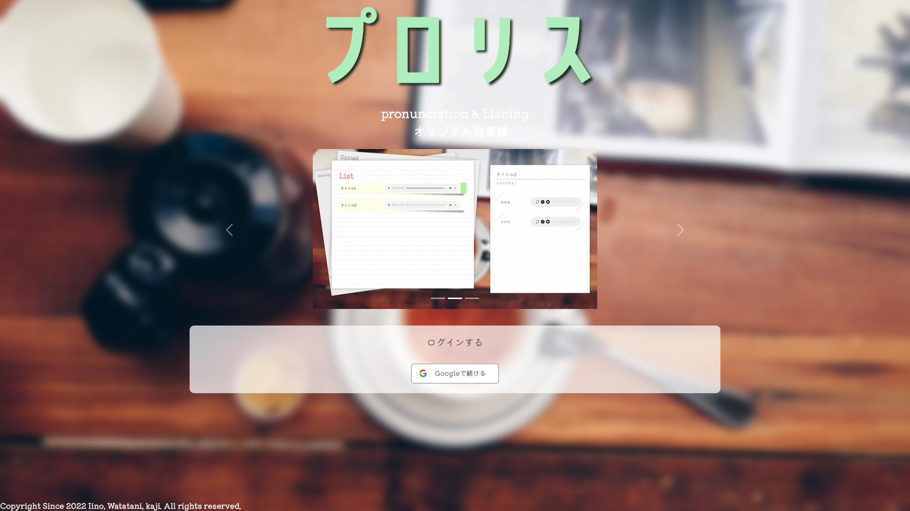
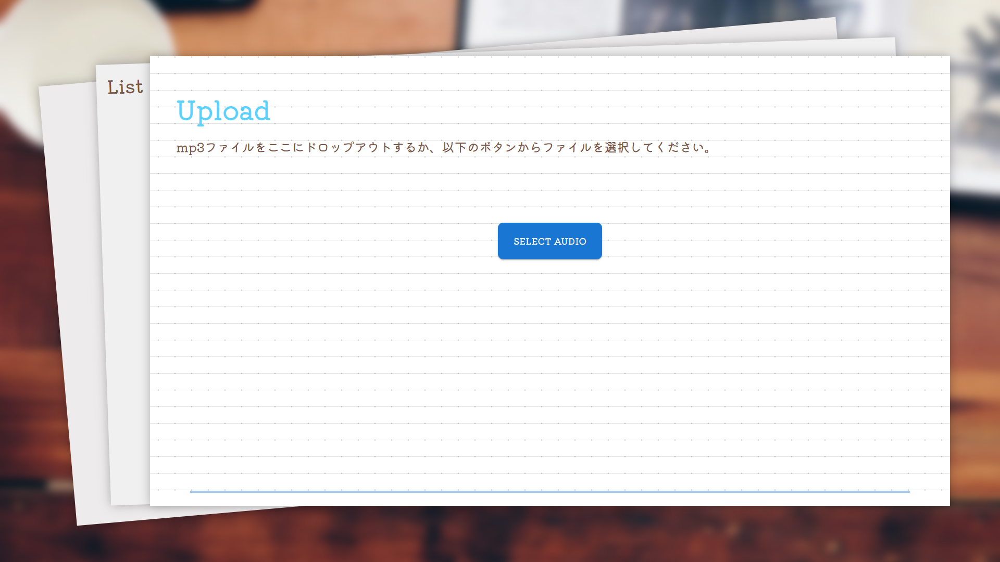
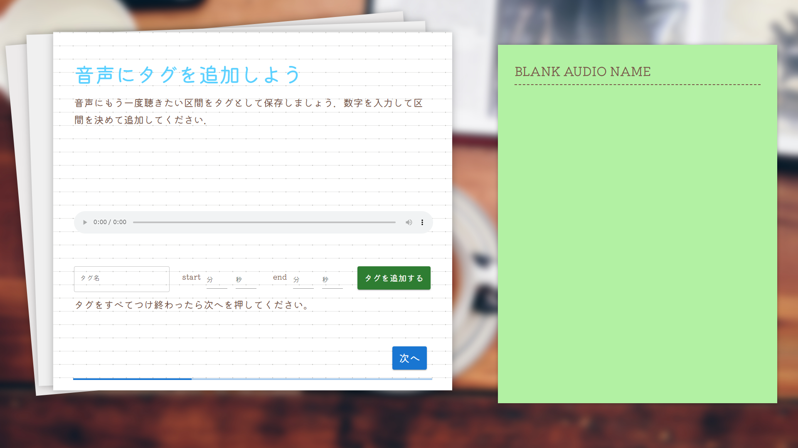
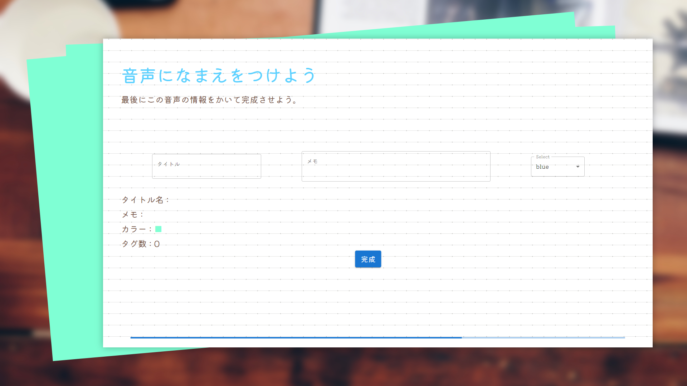
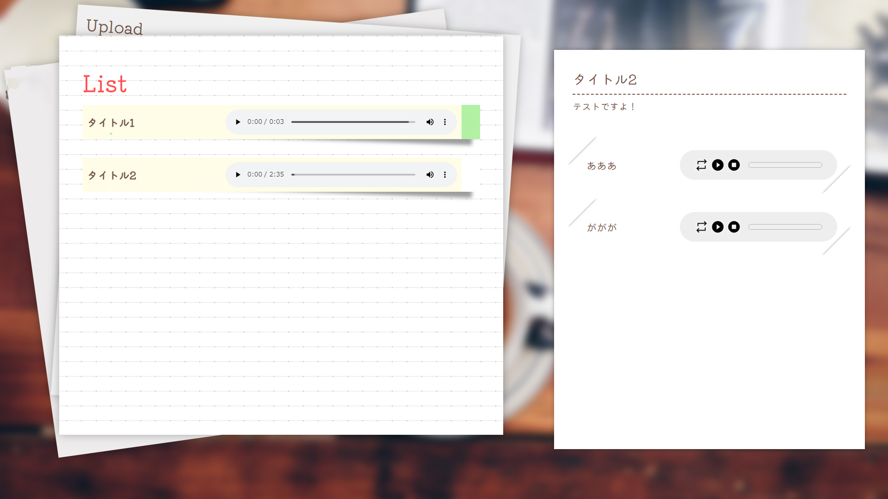
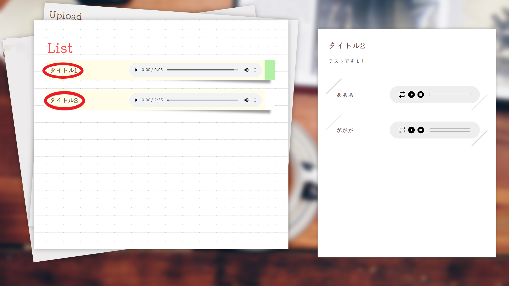
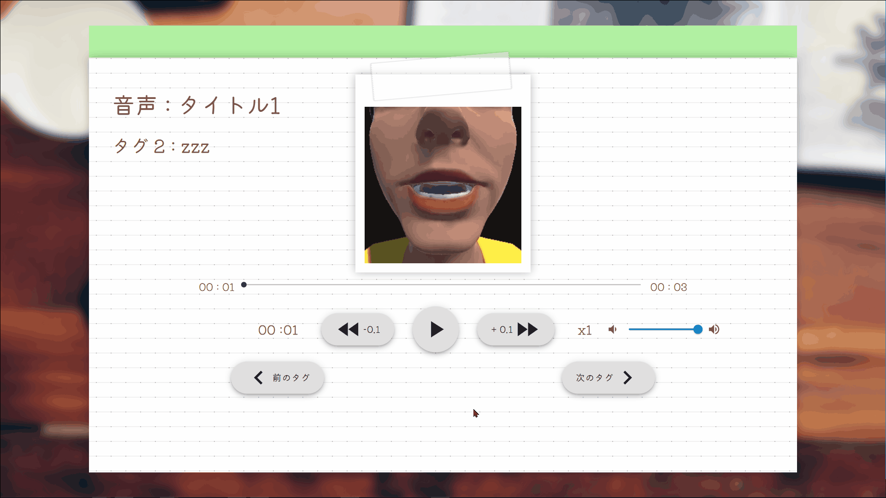
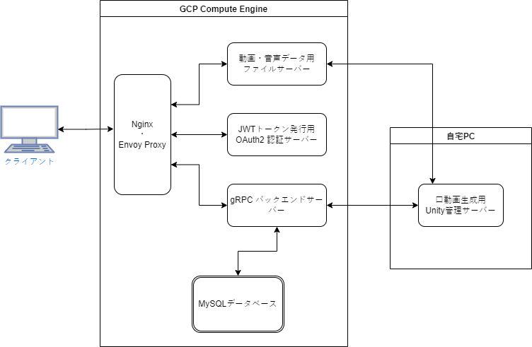

# プロリス ~ pronunciation & Listening ~

<div align="center">

</div>

## ■ 紹介動画

URL：https://youtu.be/5AdvY4PC1Hs

## ■ 製品概要

本製品は付箋をつけるように音声の一部を保存、再生できる製品となります。

更に、音声から口の動きをシュミレートして見せることでリンキング(2 つの単語をつなげて発音すること)などをより分かりやすくし、またスピーキング練習や口の動きを見ながらリスニングの理解力を高めることができます。

**あなたオリジナルの発音帳を作りましょう！**

## ■ 使用する際の注意点

- 通常のモニター以外のアスペクト比には対応していないため、デザインが崩れる可能性があります。ディスプレイの表示スケールを 100%にして使用することを推奨します。
- Unity 管理サーバーは windows OS でないと使用できません。Linux OS では使えません。

## ■ 製品説明（具体的な製品の説明）

### ● 使用準備

準備をここに書く．

### ● Upload で音声に”タグ”を追加しよう

Upload で使いたい音声ファイルを選択して、音声にタイトルとタグ付けができます。

<div align="center">

</div>
最初に、mp3の音声ファイルを選択します。

<div align="center">

</div>
次に、音声の聞き返したい部分を選択して、タグとして追加できます。その区間のタグ名と開始時間と終了時間を設定して追加してください。

<div align="center">

</div>
最後に、音声の情報（タイトル名、メモ、タグカラー）を記入して完了です。

### ● List で音声を聞き返そう

<div align="center">

</div>
List から Upload で選択した音声と追加したタグが聞けます。

- 画面左側で、元になった音声全体が聞けます。
- つけたタグを聞きたいときは、画面右側で再生できます。
- 別の音声のタグを聞きたいときは、画面左側で聞きたい音声にカーソルを合わせると画面右側が変わり、聞けるようになります。

### ● 口の動きを見てみよう

アップロードした音声の口の動きが確認できます。

<div align="center">

</div>
画像にある赤丸で囲んでいる部分をクリックしてください。

<div align="center">

</div>
タグごとで設定した区間の音声が再生でき、その区間の口の動きが確認できます。

## ■ 製品の特長

### 1. 音声の一部をタグ付けして、再生ができる

- 選択した音声から聞き返したい部分を選んでタグ付けができます。
- 一つの音声に対して複数箇所をタグ付けすることも可能です。
- タグ付けした音声に色や名前を付けて管理することが可能です。

### 2. タグ付けした音声を、元になっている音声毎にまとめることができる

- タグ付けした音声は元となった音声と共に確認することができます。

### 3. 音声データから口の動きを生成できる

- 音声データを解析することで、口の動きをシュミレートして見ることができます。

## ■ 開発技術

### ネットワーク構成

<div align="center">

</div>

### ● 主に使用した技術

#### API・データ

- GoogleOauth2.0

#### フレームワーク・ライブラリ・モジュール

- Next.js
- docker
- material UI
- gRPC
- Oculus Lipsync Unity

## ■ 著作権について

Copyright (C) 2022 Kakerukitahara, Watatani, kaji このソースコードは MIT ライセンスを保有しています。

## ■ 免責

生じた如何なる損害や修正や更新も責任を負いません。 使用する際は自己責任でお願いします。

## ■ 製作について

JPHACKS 様のハッカソン(https://jphacks.com/)で1週間の短期の中での開発をさせていただきました。短期間がゆえに濃い経験やチームを円滑に動かす技術を学ばせていただきました。このような機会を設けていただきありがとうございました。

## ■ 更新情報

```
v1.0
・ハッカソン開発期間終了．公開．
```
